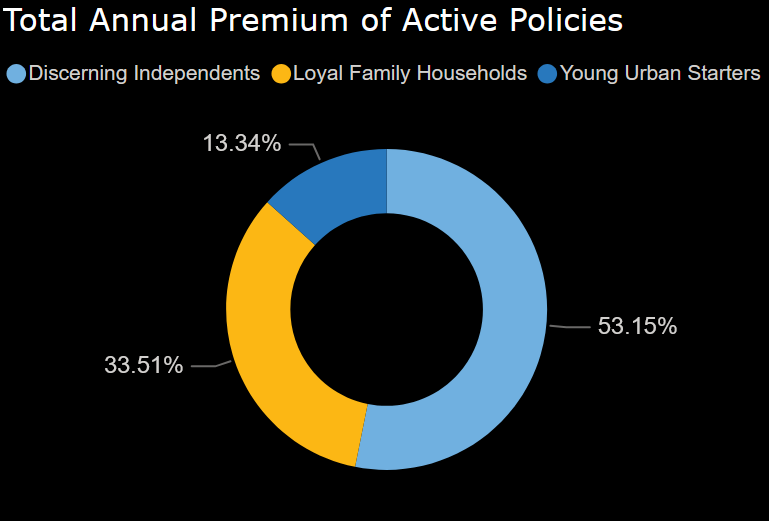
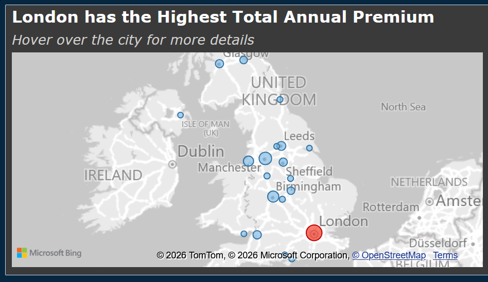
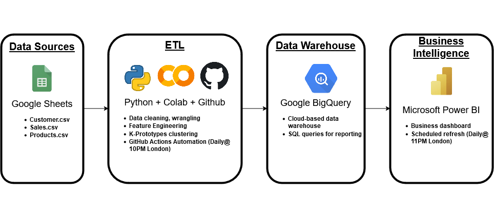
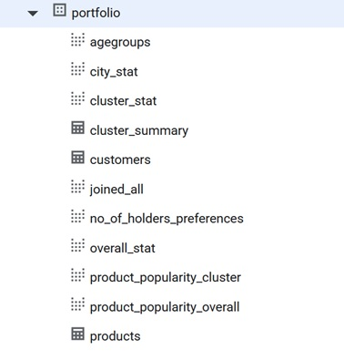

# Customer Clustering and Sales Analytics with K-Prototype

---
## Problem Statement

With rising competition and evolving customer expectations, insurers leverage data-driven intelligence to understand customer behavior and tailor their offerings accordingly. Customer segmentation provides a structured way to group individuals with shared characteristics, enabling more efficient targeting and marketing strategies.

---

## Project Summary

> **Note:**  
> *This public repository is intended for demonstration purposes only. The automated execution of the Python workflows runs in a separate private repository of Github.*

This project automates an end-to-end customer segmentation workflow, integrating raw data ingestion from **Google Sheets**, clustering analysis using **K-Prototypes** for mixed numeric and categorical features, data warehousing in **Google BigQuery**, and daily refreshed **Power BI dashboards**. It is designed to deliver actionable insights for marketing and sales teams through a fully automated, cloud-based, and production-ready solution.

---
## Highlights

- Fully automated from raw data to [dashboard](https://app.powerbi.com/view?r=eyJrIjoiOTdiZmExN2YtMGY0Yy00Mjc0LWI5MTgtOWJiYzM2ZDA4ZDFmIiwidCI6IjZjMWQ0MTUyLTM5ZDAtNDRjYS04OGQ5LWI4ZDZkZGNhMDcwOCIsImMiOjEwfQ%3D%3D) insights
- Cloud-native design using BigQuery and Power BI
- Real-world use of mixed-type clustering with K-Prototypes
- Business-friendly, scalable, and no manual refreshes required

---

## Business Impact

This solution enables insurers to operationalize customer segmentation for commercial decision-making, driving measurable value across *sales*, *marketing*, and *product* teams. Key impacts include:

- **Targeted Marketing & Improved Conversion**: Segmentation enables marketing teams to tailor campaigns and offers to specific customer cohorts, reducing untargeted spend and improving lead conversion.

- **Increased Revenue via Cross-Sell & Upsell**: Segment profiles (e.g., high-income mid-life customers) reveal opportunities to introduce higher-value products or bundle policies, increasing premium per customer and Customer Lifetime Value (CLV).

- **Higher Retention of High-Value Customers**: Tenure-driven insights highlight that long-standing customers deliver higher CLV, enabling proactive retention programs for profitable cohorts.

- **Product & Portfolio Strategy Optimization**: Product performance by customer segment identifies which insurance products drive premium growth and which should be prioritized for development, pricing, and sales emphasis.

- **Geo-Targeted Commercial Planning**: Insights on revenue concentration by location allow sales teams to allocate resources, budgets, and agents to high-value geographies.

---

## Business Analytics & Insights

### Customer Segmentation Overview
The clustering analysis identifies three customer segments with clear differences in demographics, value contribution, and insurance behaviour.

## Customer Segmentation Overview

| Segment | Profile | Business Value |Business Tactics|
| --- | --- | --- | --- |
| **Young Urban Starters** | Younger, budget-conscious customers with lower income and shorter policy tenure. | Lower current premium and CLV, but represent an important pool of future growth. | Entry-level pricing, affordable bundles. |
| **Discerning Independents** | Middle-aged, high-income individuals with moderate tenure, often single or divorced. | Currently contribute the **largest share of total annual premium**, making them a key revenue segment despite relatively lower per-customer CLV due to short tenure. | Upsell and cross-sell add-on covering not only business but also life insurance products. |
| **Loyal Family Households** | Mature, predominantly married customers with the **longest policy tenure**. Strong focus on family and long-term protection. | Provide **stable, predictable revenue** and the **highest CLV** across segments. They form the backbone of long-term profitability. | Renewal incentives, long-term loyalty programs, family bundles and multi-policy discounts. |

### Key Analytical Findings
- **Revenue concentration is segment-driven:** **Discerning Independents** contribute the largest share of total annual premium driven by higher-income profiles and demand for higher-value insurance products, despite not being the largest segment by customer count.
- **Retention drives profitability:** Customers with 10+ years tenure are consistently represented among high-CLV and top-premium customers. This highlights the importance of customer retention strategies in driving revenue and lifetime value.
- **Young customers drive volume, not value:** Younger customers aged 18–30 (*Young Urban Starters*) appear in higher volume but contribute lower total premium due to lower coverage.
- **Product performance varies by segment:** **Business** products generate the highest total premiums, led by *OfficeProtect* and *MotorShield*.
- **Geography matters:** **London** generates the highest total annual premium, indicating a strong concentration of high-value customers.

 

---
## Technologies Used

- **Python**: `pandas`, `seaborn`, `matplotlib`, `kmodes`, `gower`, `prince`, `sklearn`, `pandas-gbq`
- **Artificial Intelligence**: gemini-2.5-flash 
- **GitHub Actions**: automation of Python scripts
- **Google BigQuery**: SQL
- **Power BI**: real-time [dashboards](https://app.powerbi.com/view?r=eyJrIjoiOTdiZmExN2YtMGY0Yy00Mjc0LWI5MTgtOWJiYzM2ZDA4ZDFmIiwidCI6IjZjMWQ0MTUyLTM5ZDAtNDRjYS04OGQ5LWI4ZDZkZGNhMDcwOCIsImMiOjEwfQ%3D%3D)

---
## ETL Pipeline

**End-to-end automated data flow from ingestion to BI dashboard**

---

## Workflow Overview

This is a project covering an automated end-to-end data pipeline which performs clustering, stores the output in a warehouse, and updates a [live dashboard](https://app.powerbi.com/view?r=eyJrIjoiOTdiZmExN2YtMGY0Yy00Mjc0LWI5MTgtOWJiYzM2ZDA4ZDFmIiwidCI6IjZjMWQ0MTUyLTM5ZDAtNDRjYS04OGQ5LWI4ZDZkZGNhMDcwOCIsImMiOjEwfQ%3D%3D).

1. **Data Ingestion**: Collecting raw data from Google Sheets: [customers.csv](https://docs.google.com/spreadsheets/d/1bzB4VDQEQz0BIbyT2BCIvcE2rPSAlOcmeQuvMtuIFcI/export?format=csv), [sales.csv](https://docs.google.com/spreadsheets/d/1xrPtoy8R965CPSCS59_hcLP1cwzNcp7DJ2MOegZrsVA/export?format=csv), [products.csv](https://docs.google.com/spreadsheets/d/1HpCKgERS0F9qjHh3y0_GZ988JjX4vtKBX5rIksCgB5I/gviz/tq?tqx=out:csv&gid=0)

2. **Data Processing (Extract-Transform-Load ETL)**  
- Data cleaning (e.g. checking any missing values or duplicates)
- Data wrangling and feature engineering to ensure the data is in the right format for K-Prototype clustering
- K-Prototypes clustering
- Segment labeling and description generated by Gemini 2.5 Flash
- Loading the updated customers, sales and products tables to Google BigQuery
- Automation of the above process via GitHub Actions (daily at 10PM UK time) 
  
3. **Data Warehousing**: Processed model outputs were stored as tables in BigQuery for reporting and analysis, alongside views generated from SQL queries.

4. **Business Intelligence**: A [live dashboard](https://app.powerbi.com/view?r=eyJrIjoiOTdiZmExN2YtMGY0Yy00Mjc0LWI5MTgtOWJiYzM2ZDA4ZDFmIiwidCI6IjZjMWQ0MTUyLTM5ZDAtNDRjYS04OGQ5LWI4ZDZkZGNhMDcwOCIsImMiOjEwfQ%3D%3D) in Microsoft Power BI shows an analysis of customer and sales data the company. Data is scheduled for an automatic update on a daily basis at 11PM UK time.

---

## Schedule & Maintenance

| Layer           | Schedule             | Managed By         |
|----------------|----------------------|---------------------|
| Python Script  | Daily @ 10pm BST     | GitHub Actions      |
| BigQuery Views | Live / real-time     | Google BigQuery     |
| Power BI       | Daily @ 11pm BST     | Power BI Scheduler  |

---

## Author

**Carmen Wong**
